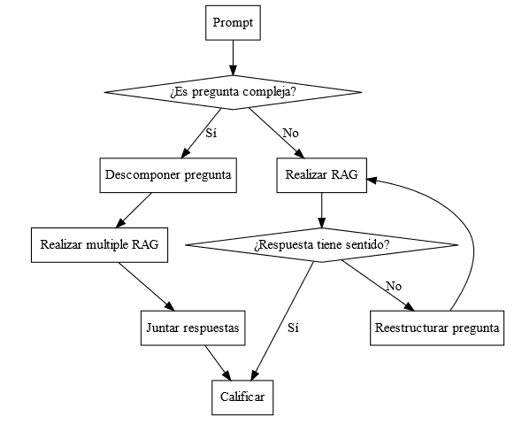

# Automatic Essay Scoring with LLM Agents

Automated grading system for university reports using LLM agents and RAG (Retrieval-Augmented Generation). The system reads a PDF report, processes it against a defined rubric and returns a justified score for each criterion.

Developed as undergraduate thesis — Computer Civil Engineering, Universidad Católica del Maule.

## Requirements

- [Ollama](https://ollama.com/) running locally
- Llama 3.1 model: `ollama pull llama3.1`
- nomic-embed-text embeddings: `ollama pull nomic-embed-text`

## Installation

```bash
git clone https://github.com/DiegoGUrra/automatic-scoring-LLM
cd automatic-scoring-LLM
pip install -r requirements.txt
```

## Usage

Open `aes_llm.ipynb` in Jupyter and set the path to your PDF report:

```python
file_path = "./your-report.pdf"
```

Define your rubric criteria as inputs:

```python
inputs = [
    {
        "question": "Does the report describe search algorithms with their computational complexity?",
        "rubric": """- Two algorithms with complexity - 5 points
- Two algorithms - 4 points
- One algorithm with complexity - 3 points
- One algorithm - 1 point"""
    },
    ...
]
```

Run all cells. Each criterion returns a score and justification.

## Architecture

The system evolved through four stages:

| Stage | Approach |
|-------|----------|
| 1 | Simple RAG — one prompt per rubric criterion |
| 2 | RAG with conversation history — question + evaluation split |
| 3 | LangGraph agents with hallucination detection and question reformulation |
| 4 | Complex question decomposition into sub-questions before grading |

### Stage 4 Agent Graph



## Tech Stack

- **Llama 3.1** — local LLM via Ollama
- **nomic-embed-text** — embeddings model
- **LangChain** — RAG chain orchestration
- **LangGraph** — stateful agent graph
- **ChromaDB** — vector store for semantic search
- **PyPDF** — PDF loading and parsing

## License

MIT
